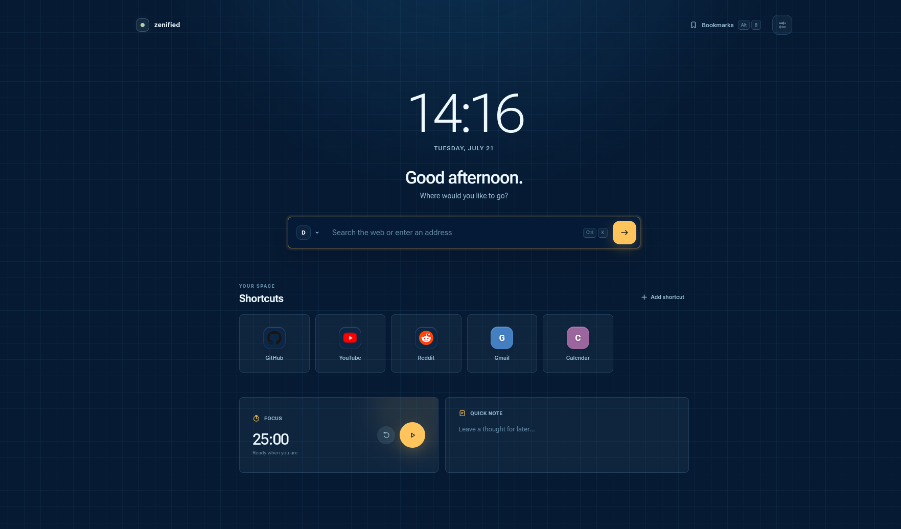

# Zenified Start Page

A lightweight Firefox/Zen Browser new-tab extension with NO framework, build step, analytics, or remote code.

### Requires Firefox 142 or up.

## Features

- Active Zen/Firefox theme palette detection with a system-color fallback
- Auto, AMOLED black, Aurora, Dawn, Slate, Sakura, Ultraviolet, Blueprint, Porcelain, Ember, Terminal, and Redline themes
- Centered, Editorial, and Compact page layouts
- Editable, draggable shortcuts with direct-from-site favicons and an optional large add tile
- Searchable Firefox bookmarks drawer
- Ranked local suggestions from bookmarks and browser history
- 12/24-hour clock, focus timer, and locally saved quick note
- Type anywhere to search, plus keyboard shortcuts (`/`, `Ctrl/Cmd+K`, `Alt+B`, and `Esc`)
- New-tab and homepage overrides so the dashboard opens in new windows and normal browser startups

## How to install

1. Download the last version from Release page (https://github.com/Kexfff/zenified-start-page/releases/tag/v1.3.0)
2. Add to your Firefox installation
3. Be happy

## Privacy

The extension does not collect or transmit data for analytics or external processing. Shortcuts, preferences, notes, and timer state use Firefox extension storage. Bookmark and history access is used locally for the bookmarks drawer and search suggestions; those records never leave the browser. Shortcut favicons are requested directly from the shortcut's own HTTPS site, never from a third-party icon service. Search text is sent only to the selected search provider after submission.
