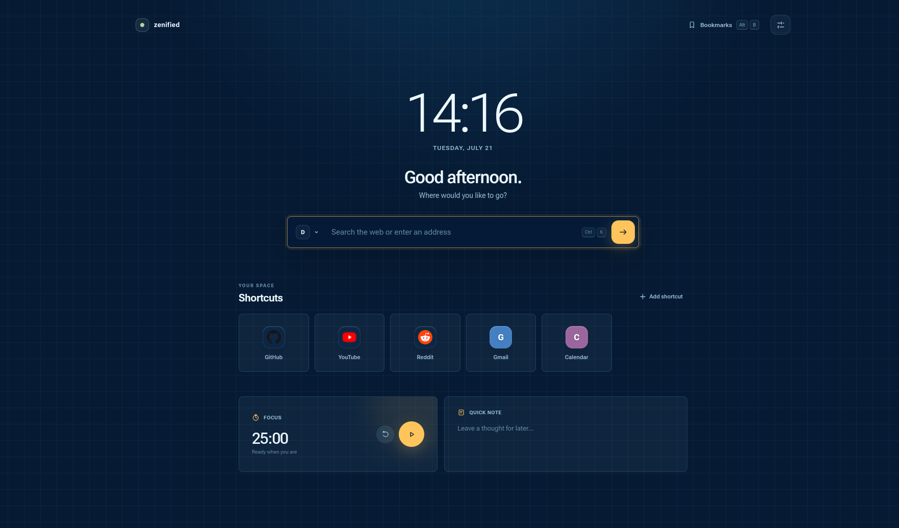

# Zenified Start Page

A lightweight Firefox/Zen Browser new-tab extension with NO framework, build step, analytics, or remote code.

### Requires Firefox 142 or up.

## Features

- Active Zen/Firefox theme palette detection with a system-color fallback
- Auto, Prism, Still, Material 3, Material 3 Dark, Nocturne, AMOLED black, Aurora, Dawn, Slate, Sakura, Ultraviolet, Blueprint, Porcelain, Ember, Terminal, and Redline themes
- Centered, Editorial, Compact, Dashboard, Sidebar, and Panorama page layouts
- Your own background picture with shade, blur, and position controls, saved only in this browser
- Editable, draggable shortcuts with direct-from-site favicons and an optional large add tile
- Searchable Firefox bookmarks drawer
- Ranked local suggestions from bookmarks and browser history
- 12/24-hour clock, focus timer, and locally saved quick note
- Type anywhere to search, plus keyboard shortcuts (`/`, `Ctrl/Cmd+K`, `Alt+B`, and `Esc`)
- New-tab and homepage overrides so the dashboard opens in new windows and normal browser startups

## How to install

1. Download the latest signed version from the [Releases page](https://github.com/Kexfff/zenified-start-page/releases).
2. Add to your Firefox installation
3. Be happy

## Privacy

The extension does not collect or transmit data for analytics or external processing. Shortcuts, preferences, notes, timer state, and background pictures use Firefox extension storage. Background pictures are resized locally and never uploaded to a server. Bookmark and history access is used locally for the bookmarks drawer and search suggestions; those records never leave the browser. Shortcut favicons are requested directly from the shortcut's own HTTPS site, never from a third-party icon service. Search text is sent only to the selected search provider after submission.

## Personalize your page

Open **Customize** in the top right to choose a layout or background picture. Dashboard pairs shortcuts with stacked tools; Sidebar puts the clock and tools beside your shortcuts; Panorama leaves more space above the page for your wallpaper. Every layout adapts to smaller screens.

In **Color theme**, try **Prism** for electric indigo, coral and gold; **Still** for gentle sage; **Material 3** or **Material 3 Dark** for Android-inspired tonal surfaces and rounded controls; or **Nocturne** for ink blue, warm gold and a serif clock. These themes also work with your own picture, keeping the photo visible while applying the theme's accents and shapes.

Choose a JPG, PNG, WebP, GIF, or AVIF picture up to 15 MB. It is saved as a still JPEG, resized to at most 2560 pixels on its longest side. Use **Photo shade** for readability, **Blur** to soften busy pictures, and **Picture position** to choose which part stays visible. Picture mode uses light text and translucent controls so the photo stays visible with every theme. **Remove** restores the selected theme's background.

## Checks

Run `node tests/background.test.cjs` for the background regression checks. They cover resizing, file validation, preference defaults, and saving/loading/removing pictures with simulated Firefox and preview storage, including storage failures.

## Package for submission

Run `python3 scripts/package.py` to create `dist/zenified-start-page-1.4.0.zip`. The ZIP contains the manifest at its root, HTML, CSS, JavaScript, icon, and license. Development files, screenshots, tests, and credentials are excluded. Generated archives are ignored by Git.

Upload the ZIP as a new version of the existing add-on on Mozilla Add-ons. The package contains readable source with no build step, minification, or third-party libraries. Mozilla signs the submitted extension before it can be installed normally in Firefox.
