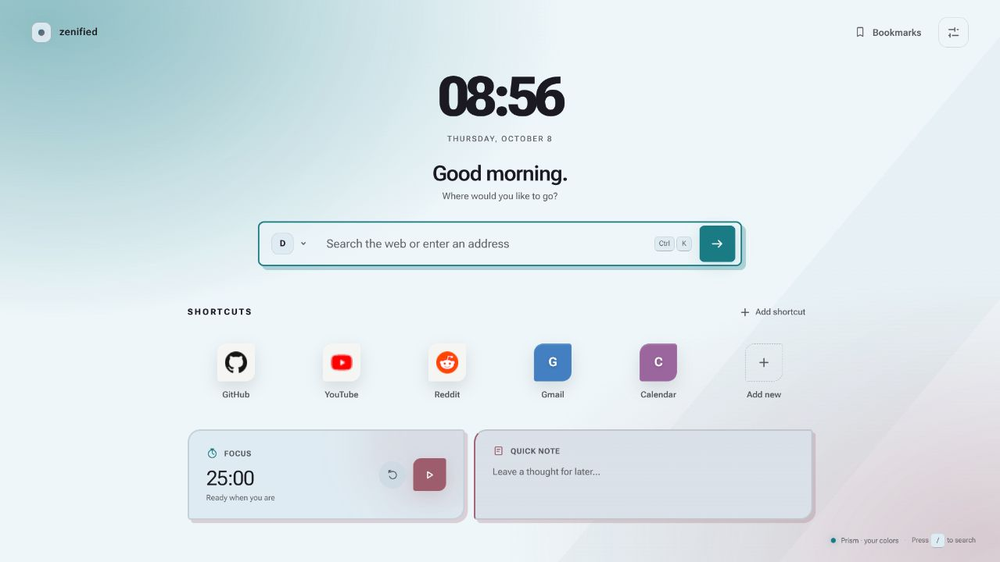
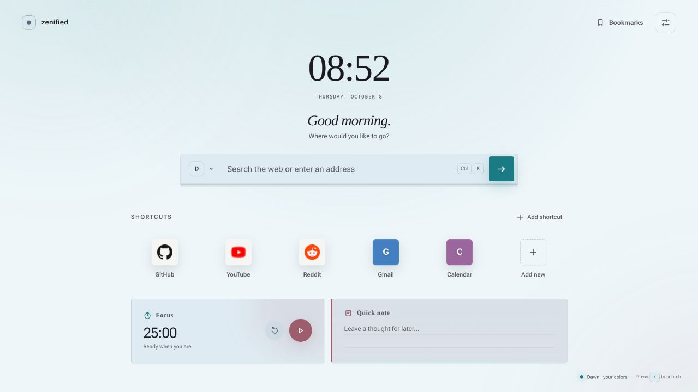
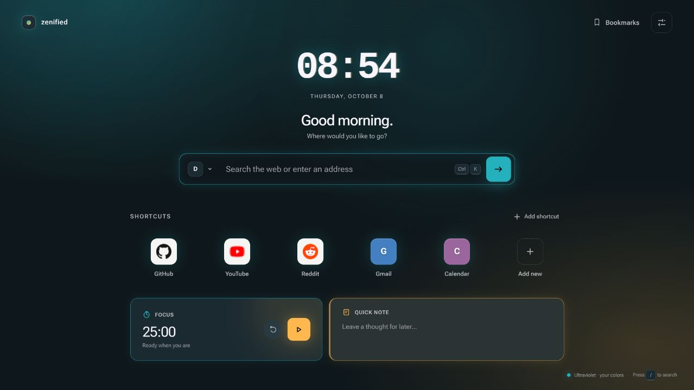
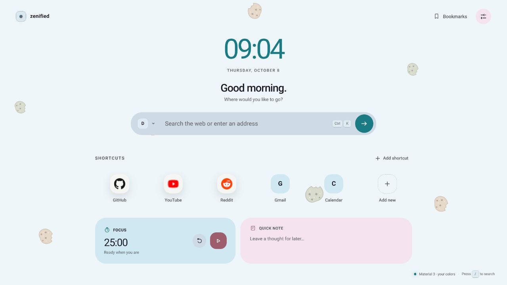
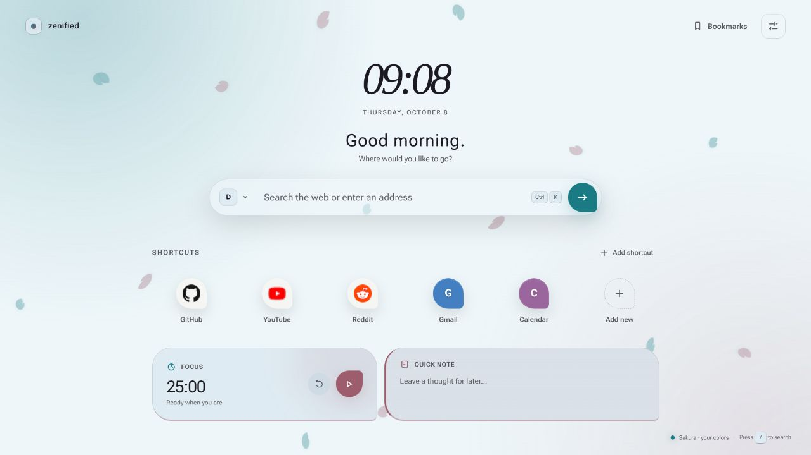
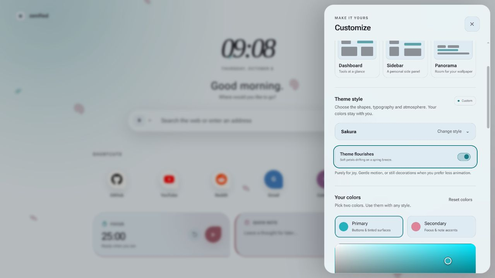

# Zenified Start Page

A lightweight Firefox/Zen Browser new-tab extension with NO framework, build step, analytics, or remote code.

**Requires Firefox 142 or up.**

## Showcase

Choose a style, then make it yours with independent primary and secondary colors. Prism and Dawn below use the same teal-and-rose palette, with different typography, shapes, and surfaces.

| Prism · bold geometry | Dawn · paper journal |
| --- | --- |
|  |  |

| Ultraviolet · neon outlines | Material 3 · cookies |
| --- | --- |
|  |  |

Switch on **Theme flourishes** for a little extra joy: drifting Sakura petals, Material cookies, and other ornaments that follow your style. The toggle saves locally, and reduced-motion preferences turn animations into still decorations.

| Sakura · drifting petals | Customize · your colors and flourishes |
| --- | --- |
|  |  |

Click any screenshot to see it at full size.

## Features

- Active Zen/Firefox theme palette detection with a system-color fallback
- Auto, Prism, Still, Material 3, Material Elevated, Nocturne, AMOLED, Aurora, Dawn, Slate, Sakura, Ultraviolet, Blueprint, Porcelain, Ember, Terminal, and Redline styles
- Independent primary and secondary colors with a gradient picker, light/dark appearance, and reset to each style's original palette
- Optional theme flourishes: drifting Sakura petals, Material cookies, stars, bubbles, leaves, confetti, orbits, sparks, and console pixels
- Centered, Editorial, Compact, Dashboard, Sidebar, and Panorama page layouts
- Your own background picture with shade, blur, and position controls, saved only in this browser
- Editable, draggable shortcuts with direct-from-site favicons and an optional large add tile
- Searchable Firefox bookmarks drawer
- Ranked local suggestions from bookmarks and browser history
- 12/24-hour clock, focus timer, and locally saved quick note
- Type anywhere to search, plus keyboard shortcuts (`/`, `Ctrl/Cmd+K`, `Alt+B`, and `Esc`)
- New-tab and homepage overrides so the dashboard opens in new windows and normal browser startups

## How to install

1. Download the latest signed version from the [Releases page](https://github.com/Kexfff/zenified-start-page/releases).
2. Add to your Firefox installation
3. Be happy

## Privacy

The extension does not collect or transmit data for analytics or external processing. Shortcuts, preferences, notes, timer state, and background pictures use Firefox extension storage. Background pictures are resized locally and never uploaded to a server. Bookmark and history access is used locally for the bookmarks drawer and search suggestions; those records never leave the browser. Shortcut favicons are requested directly from the shortcut's own HTTPS site, never from a third-party icon service. Search text is sent only to the selected search provider after submission.

## Personalize your page

Open **Customize** in the top right to choose a layout or background picture. Dashboard pairs shortcuts with stacked tools; Sidebar puts the clock and tools beside your shortcuts; Panorama leaves more space above the page for your wallpaper. Every layout adapts to smaller screens.

In **Theme style**, choose shapes, typography and atmosphere. **Prism** uses bold geometry and offset shadows; **Still** uses open surfaces and fine rules. **Material 3** has tonal pills, while **Material Elevated** has raised panels. **Dawn** resembles a paper journal with ruled notes, **Blueprint** has technical frames, **Ultraviolet** has neon outlines, **Porcelain** has embossed surfaces, and **Redline** has slanted racing details. Style cards describe each treatment. Material Elevated keeps the saved settings and default palette of the former Material 3 Dark style.

In **Your colors**, choose **Primary** or **Secondary**, then use the gradient and hue slider to make your palette. You can also enter a three or six digit hex color and choose light or dark appearance. Primary colors the search action and main accents; secondary colors the Focus button, timer progress, and note accents. Button text adjusts for contrast. Colors preview instantly and save locally. Tinted surfaces, glows, accents and readable text shades are generated from your choices. Your colors stay the same when switching styles, including Auto, and also work with background pictures.

**Reset colors** restores the selected style's original palette without changing its style, layout, notes, shortcuts or photo. For Auto, reset returns to the active Zen / Firefox palette or system appearance. The gradient supports mouse and touch; left/right arrows adjust saturation, up/down arrows adjust brightness, and Shift makes larger steps. The hue slider and all other controls also support the keyboard.

Switch on **Theme flourishes** under Theme style for little decorations that follow your chosen style. Sakura gets drifting petals; both Material styles get cookies. Other styles have stars, bubbles, leaves, confetti, orbits, sparks, or pixels. Flourishes start off, save locally, follow your colors, and sit behind the controls. They use local vector artwork and gentle CSS motion, pause in hidden tabs, and become still ornaments when the system requests reduced motion.

Choose a JPG, PNG, WebP, GIF, or AVIF picture up to 15 MB. It is saved as a still JPEG, resized to at most 2560 pixels on its longest side. Use **Photo shade** for readability, **Blur** to soften busy pictures, and **Picture position** to choose which part stays visible. Picture mode uses light text and translucent controls so the photo stays visible with every theme. **Remove** restores the selected theme's background.

## Checks

Run `node --test tests/*.test.cjs` for the regression checks. They cover picture resizing and validation, preference migration, saving/loading/removing pictures and colors in simulated Firefox and preview storage, save failures, and text contrast for extreme color combinations.

## Package for submission

Run `python3 scripts/package.py` to create `dist/zenified-start-page-1.5.0.zip`. The ZIP contains the manifest at its root, HTML, CSS, JavaScript, icon, and license. Development files, screenshots, tests, and credentials are excluded. Generated archives are ignored by Git.

Upload the ZIP as a new version of the existing add-on on Mozilla Add-ons. The package contains readable source with no build step, minification, or third-party libraries. Mozilla signs the submitted extension before it can be installed normally in Firefox.
